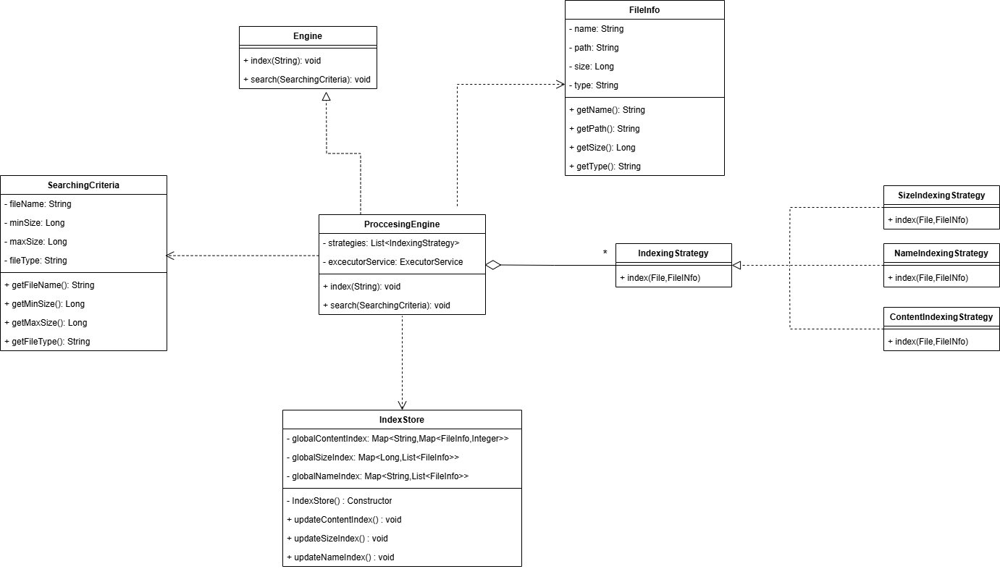

# File Retrieval Engine

## Table of Contents
- [Introduction](#introduction)
- [Features](#features)
- [Architecture](#architecture)
- [Class-Diagram](#class-diagram)
- [Getting Started](#getting-started)
- [Installation](#installation)
- [Usage](#usage)

## Introduction
A high-performance, multithreaded **File Retrieval Engine** designed to index and search text files efficiently. Built with scalability in mind, it supports both single-term and AND-based multi-term queries, returning results sorted by relevance. Ideal for large-scale document datasets.

## Features
- **Multithreaded indexing** for faster file processing
- **Efficient search algorithm** to retrieve the top 10 relevant files
- **Modular architecture** for easy maintenance and scalability
- **Customizable** indexing and searching strategies
- **Client-Server Architecture**: Supports simultaneous operations across multiple clients (optional, if implemented)

## Architecture
The File Retrieval Engine follows an Application Layering architecture, which includes the following layers:
1. **Presentation Layer**: Manages user interactions through a REST API.
2. **Application Layer**: Contains business logic and coordinates data flow.
3. **Data Layer**: Handles file storage, indexing, and retrieval mechanisms.

## Class-Diagram:

## Getting Started

### Prerequisites
- Java Development Kit (JDK) 8 or higher
- Maven (for dependency management and building the project)

### Installation

1. Clone the repository:

   ```bash
   git clone https://github.com/Abduh-Belhaje/File-Retrieval-Engine-.git

2. Navigate to the project directory:

   ```bash
   cd File-Retrieval-Engine-

3. Build the project using Maven:

   ```bash
   mvn clean install

### Usage

- Run the application:

   ```bash
   java -jar target/File-Retrieval-Engine-1.0-SNAPSHOT.jar

### Using the REST API

The File Retrieval Engine exposes a REST API for programmatic access. This allows you to perform file indexing and search operations over HTTP.

> **Note**: The server must be running before making requests to the API. By default, the API runs at `http://localhost:8080`.

#### Endpoints:

- #### **Search Files**
  `POST /search`  
  Index files located in the specified directory.

  **Request Body (JSON)**:

        {
          "contentSearchTerm": "word1 word2",
          "minSize": "3934630", // by octet ==> 3843ko
          "maxSize": "4096000", // by octet ==> 4000ko
          "fileName": "filename", 
        }

  **Response (JSON)**:

       [
          {
            "name": "comp.windows.x.txt",
            "path": ".\\DataSet\\comp.windows.x.txt",
            "size": 3934630,
            "last_modification": 1738348307731,
            "type": "txt"
          },
          ...
       ]


